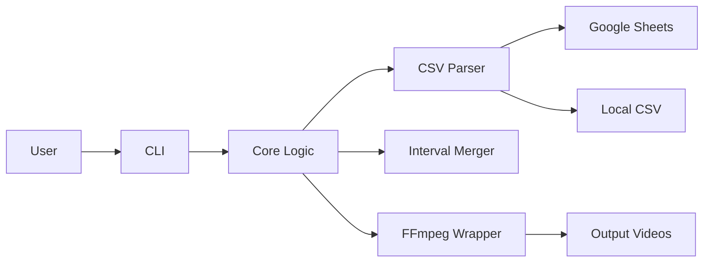
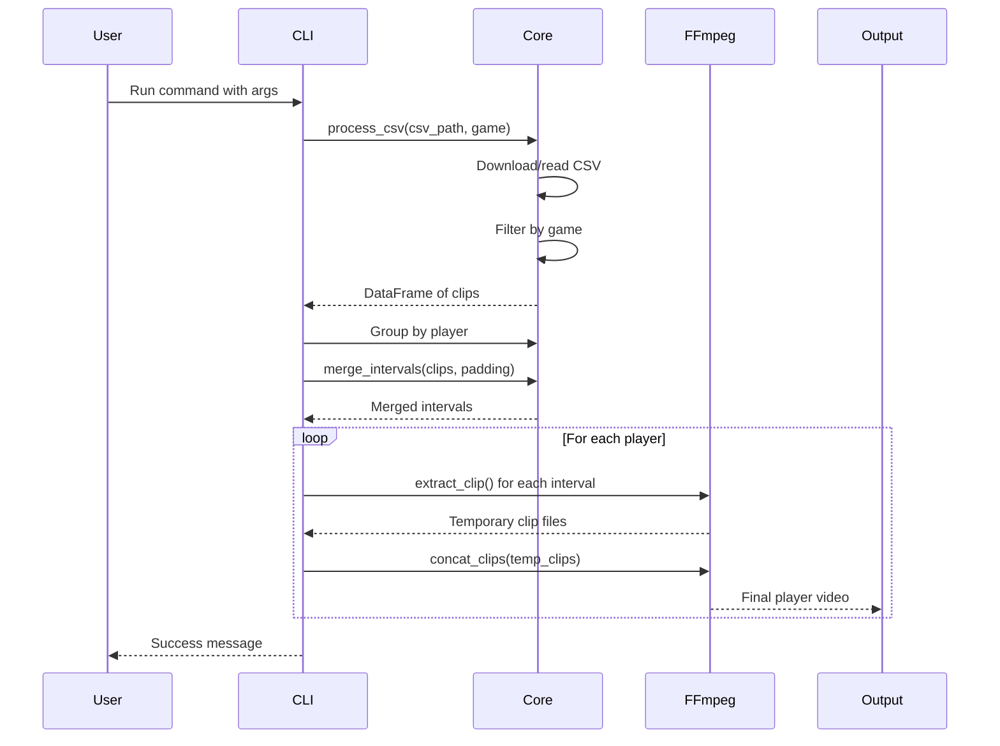

# Architecture & Design

This document provides a technical overview of the `highlight-cuts` architecture, design decisions, and implementation details.

## System Overview



## Architecture Principles

### 1. Separation of Concerns

The codebase is organized into distinct modules with clear responsibilities:

- **CLI Layer** (`cli.py`): User interface, argument parsing, orchestration
- **Core Logic** (`core.py`): Business logic, data processing, no side effects
- **FFmpeg Wrapper** (`ffmpeg.py`): External process management, file I/O
- **Utilities** (`utils.py`): Pure functions, time parsing, helpers

### 2. Testability First

- Core logic is pure and deterministic (no I/O, no side effects)
- External dependencies (FFmpeg, file system) are isolated in wrapper modules
- Unit tests mock I/O operations for fast, reliable testing
- Integration tests verify end-to-end functionality with real FFmpeg

### 3. Fast by Default

- Uses FFmpeg's `-c copy` (stream copy) mode for maximum speed
- No re-encoding unless absolutely necessary
- Processes multiple clips per player in a single FFmpeg operation

## Module Design

### `cli.py` - Command-Line Interface

**Responsibility**: Parse arguments, validate inputs, orchestrate workflow.

**Key Functions**:
- `main()`: Entry point, uses Click framework
- Argument validation and type conversion
- Calls core logic and FFmpeg wrappers
- Handles dry-run mode

**Design Decisions**:
- Uses Click for argument parsing (declarative, well-documented)
- Minimal logic - delegates to core modules
- Prints user-friendly progress messages

**Data Flow**:
```
User Input → Click Parsing → Validation → Core Processing → FFmpeg Execution → Output
```

### `core.py` - Business Logic

**Responsibility**: CSV processing, interval merging, clip planning.

**Key Functions**:

#### `normalize_sheets_url(url: str) -> str`
Converts any Google Sheets URL format to CSV export endpoint.

**Supported formats**:
- Sharing URLs: `...edit?usp=sharing`
- Edit URLs: `...edit#gid=123`
- Export URLs: `...export?format=csv`

**Output**: `https://docs.google.com/spreadsheets/d/{SHEET_ID}/gviz/tq?tqx=out:csv&gid={GID}`

#### `process_csv(csv_path: str, game_name: str) -> pd.DataFrame`
Reads CSV (local file or Google Sheets URL) and filters by game.

**Logic**:
1. Detect if input is URL or file path
2. For URLs: Download using `requests` library
3. Parse with `pandas.read_csv()`
4. Filter rows where `videoName == game_name`
5. Return DataFrame with columns: `startTime`, `stopTime`, `playerName`

#### `merge_intervals(intervals: List[Tuple[float, float]], padding: float) -> List[Tuple[float, float]]`
Merges overlapping or adjacent time intervals.

**Algorithm**:
1. Apply padding to each interval: `(start - padding, end + padding)`
2. Sort intervals by start time
3. Iterate and merge overlapping intervals
4. Return merged list

**Example**:
```python
intervals = [(10, 20), (15, 25), (30, 40)]
padding = 2.0

# After padding: [(8, 22), (13, 27), (28, 42)]
# After merging: [(8, 27), (28, 42)]
```

**Why merge?**
- Avoids duplicate content in output
- Creates smoother highlight reels
- Reduces FFmpeg operations

### `ffmpeg.py` - FFmpeg Wrapper

**Responsibility**: Execute FFmpeg commands, manage temporary files.

**Key Functions**:

#### `extract_clip(video_path, start, end, output_path)`
Extracts a single clip using stream copy.

**FFmpeg command**:
```bash
ffmpeg -i input.mp4 -ss START -to END -c copy output.mp4
```

**Flags**:
- `-ss START`: Seek to start time
- `-to END`: End time
- `-c copy`: Stream copy (no re-encoding)

#### `concat_clips(clip_paths, output_path)`
Concatenates multiple clips into one video.

**FFmpeg command**:
```bash
ffmpeg -f concat -safe 0 -i filelist.txt -c copy output.mp4
```

**Process**:
1. Create temporary `filelist.txt` with clip paths
2. Use FFmpeg concat demuxer
3. Stream copy for speed
4. Clean up temporary file

**Design Decisions**:
- Uses `subprocess.run()` for process management
- Captures stdout/stderr for debugging
- Raises exceptions on FFmpeg errors
- No shell=True (prevents command injection)

### `utils.py` - Utility Functions

**Responsibility**: Pure helper functions.

**Key Functions**:

#### `parse_time(time_str: str) -> float`
Converts time string to seconds.

**Supported formats**:
- `HH:MM:SS` → `hours * 3600 + minutes * 60 + seconds`
- `MM:SS` → `minutes * 60 + seconds`

**Implementation**:
```python
def parse_time(time_str: str) -> float:
    parts = time_str.split(":")
    if len(parts) == 3:  # HH:MM:SS
        return int(parts[0]) * 3600 + int(parts[1]) * 60 + float(parts[2])
    elif len(parts) == 2:  # MM:SS
        return int(parts[0]) * 60 + float(parts[1])
    else:
        raise ValueError(f"Invalid time format: {time_str}")
```

## Data Flow

### End-to-End Processing



### Interval Merging Example

**Input CSV**:
```csv
videoName,startTime,stopTime,playerName
Game1,00:01:00,00:01:10,Alice
Game1,00:01:08,00:01:20,Alice
Game1,00:05:00,00:05:15,Alice
```

**Processing**:
1. Parse times: `[(60, 70), (68, 80), (300, 315)]`
2. Apply padding (2s): `[(58, 72), (66, 82), (298, 317)]`
3. Merge overlapping: `[(58, 82), (298, 317)]`
4. Extract 2 clips instead of 3
5. Concatenate into `Game1_Alice.mp4`

## Design Decisions

### Why Stream Copy?

**Alternatives Considered**:
1. **Re-encoding**: Decode → Edit → Encode
2. **Stream Copy**: Copy raw streams without decoding

**Decision**: Stream copy (current implementation)

**Rationale**:
- ⚡ **Speed**: 100x faster (seconds vs. minutes)
- 🎯 **Quality**: Zero generation loss
- 💾 **Efficiency**: Minimal CPU/memory usage

**Trade-off**:
- ⚠️ **Keyframe snapping**: Clips may start/end slightly off (±1-2 seconds)
- ⚠️ **Codec limitations**: Requires compatible codecs

**Mitigation**:
- Document keyframe behavior in user guide
- Recommend padding to ensure important moments are captured
- Future: Add `--re-encode` option for frame-accurate cuts

### Why Merge Intervals?

**Alternatives Considered**:
1. **No merging**: Create separate clips for each row
2. **Merge overlapping**: Combine overlapping intervals (current)
3. **Smart scene detection**: Use AI to detect natural break points

**Decision**: Merge overlapping intervals

**Rationale**:
- Avoids duplicate content
- Creates smoother highlight reels
- Reduces FFmpeg operations (faster)
- Simple, predictable algorithm

**Example Use Case**:
Player makes a steal at 1:00 and scores at 1:05. Instead of two separate clips with duplicate content, create one continuous 1:00-1:10 clip.

### Why Pandas for CSV?

**Alternatives Considered**:
1. **csv module**: Python standard library
2. **pandas**: Data analysis library (current)

**Decision**: Pandas

**Rationale**:
- Powerful filtering and grouping operations
- Handles CSV encoding issues gracefully
- Familiar to data scientists
- Easy to extend for future features (statistics, reports)

**Trade-off**:
- Heavier dependency (~50MB)
- Overkill for simple CSV parsing

**Future**: Could switch to `csv` module if minimizing dependencies becomes important.

### Why Click for CLI?

**Alternatives Considered**:
1. **argparse**: Python standard library
2. **Click**: Third-party framework (current)
3. **Typer**: Modern alternative

**Decision**: Click

**Rationale**:
- Declarative, readable syntax
- Automatic help generation
- Type validation built-in
- Well-documented, widely used

## Testing Strategy

### Unit Tests

**Coverage**: 96%

**Approach**:
- Mock all I/O operations (FFmpeg, file system, network)
- Test core logic in isolation
- Fast execution (< 1 second for all unit tests)

**Example**:
```python
@patch("subprocess.run")
def test_extract_clip(mock_run):
    mock_run.return_value = MagicMock(returncode=0)
    extract_clip("input.mp4", 10.0, 20.0, "output.mp4")
    mock_run.assert_called_once()
    # Verify FFmpeg command structure
```

### Integration Tests

**Purpose**: Verify end-to-end functionality with real FFmpeg.

**Approach**:
1. Generate test video with frequent keyframes
2. Run CLI with test CSV
3. Verify output files exist and have correct duration
4. Use `ffprobe` to validate output

**Example**:
```python
def test_integration_full_workflow():
    # Generate test video
    subprocess.run(["ffmpeg", "-f", "lavfi", "-i", "testsrc=duration=60", "test.mp4"])
    
    # Run CLI
    result = runner.invoke(cli, ["--input-video", "test.mp4", ...])
    
    # Verify output
    assert result.exit_code == 0
    assert os.path.exists("output.mp4")
```

### Google Sheets Integration Tests

**Purpose**: Test Google Sheets URL handling.

**Approach**:
1. Create test sheet with known data
2. Share publicly
3. Test URL normalization
4. Verify data is downloaded correctly

**Note**: Requires manual setup (see `tests/config/README.md`)

## Performance Characteristics

### Speed

**Stream Copy Mode**:
- ~100x real-time (1 hour video → 36 seconds processing)
- Dominated by disk I/O, not CPU

**Bottlenecks**:
1. Disk I/O (reading source video)
2. Number of clips (more clips = more FFmpeg operations)
3. Network latency (for Google Sheets)

### Memory Usage

**Typical**: < 100 MB

**Pandas DataFrame**: Minimal (CSV data is small)
**FFmpeg**: Streams data, doesn't load entire video into memory

### Disk Usage

**Temporary files**: One per clip per player
**Cleanup**: Temporary clips deleted after concatenation
**Output size**: ~50% of source video size per player (depends on clip count)

## Future Architecture Considerations

### GUI Implementation

**Planned**: Streamlit web interface

**Architecture**:
```
Streamlit UI → Same Core Logic → FFmpeg Wrapper
```

**Benefits**:
- Reuse existing core logic
- No code duplication
- Easy to maintain

### Transitions (xfade)

**Impact**: Requires re-encoding

**Architecture Change**:
- Add `concat_clips_with_xfade()` function
- Modify CLI to support `--transition-type` flag
- Keep stream copy as default for speed

### Batch Processing

**Architecture**:
- Add `process_multiple_games()` function
- Parallel processing using `multiprocessing`
- Progress tracking with `tqdm`

## Error Handling

### Current Approach

- FFmpeg errors: Raise exception with stderr output
- CSV errors: Pandas raises informative exceptions
- File not found: Let Python raise `FileNotFoundError`

### Future Improvements

- Custom exception types (`FFmpegError`, `CSVFormatError`)
- Retry logic for Google Sheets downloads
- Graceful degradation (skip failed clips, continue processing)

## Dependencies

### Runtime Dependencies

- `click>=8.1.7`: CLI framework
- `pandas>=2.2.0`: CSV processing
- `requests>=2.31.0`: HTTP requests for Google Sheets

### Development Dependencies

- `pytest>=9.0.1`: Testing framework
- `pytest-cov>=7.0.0`: Coverage reporting
- `ruff>=0.14.6`: Linting and formatting

### External Dependencies

- **FFmpeg**: Must be installed separately
- **Python 3.13+**: Required for modern type hints and features

## Configuration

### Current

- All configuration via CLI arguments
- No config file support

### Future

- Support for `.highlight-cuts.yaml` config file
- Environment variables for defaults
- Per-project configuration

---

**Last Updated**: 2025-11-23
