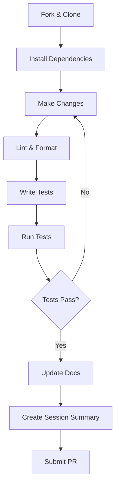

# Developer Documentation

Welcome! This directory contains technical documentation for developers and contributors.

## Getting Started

**New contributor?** Start here:

1. **[Contributing Guide](contributing.md)** - How to contribute to the project
2. **[Architecture Guide](architecture.md)** - Understand the system design
3. **[Testing Guide](testing.md)** - Write and run tests

## All Developer Guides

### Understanding the Codebase
- [Architecture & Design](architecture.md) - System design and module structure
- [Background](background.md) - Problem, solution, and technical approach
- [Tech Stack](tech_stack.md) - Technology choices and rationale

### Contributing
- [Contributing Guide](contributing.md) - Development workflow and guidelines
- [Testing Guide](testing.md) - Testing infrastructure and strategies

## Quick Links

**Common Development Tasks**:
- [Set up development environment](contributing.md#development-setup)
- [Run tests](contributing.md#running-tests)
- [Lint and format code](contributing.md#lint--format)
- [Write documentation](contributing.md#documentation)

**Architecture Deep Dives**:
- [Why stream copy?](background.md#why-stream-copy)
- [Interval merging algorithm](architecture.md#merge_intervals)
- [Module breakdown](architecture.md#module-design)
- [Testing strategy](testing.md#testing-strategies)

**Technology Details**:
- [Why FFmpeg?](background.md#why-ffmpeg)
- [Why Python?](background.md#why-python)
- [Why FastAPI?](tech_stack.md#core-backend)
- [Dependencies overview](tech_stack.md)

## Project Structure

```
highlight-cuts/
├── src/highlight_cuts/    # Source code
│   ├── cli.py            # CLI interface
│   ├── core.py           # Business logic
│   ├── ffmpeg.py         # FFmpeg wrapper
│   ├── utils.py          # Utilities
│   └── web.py            # Web interface
├── tests/                # All tests
├── docs/
│   ├── user/            # End-user docs
│   └── dev/             # This directory
├── ai/                  # AI context & summaries
└── pyproject.toml       # Project config
```

## Development Workflow



## Key Principles

1. **Separation of Concerns**: CLI → Core Logic → FFmpeg
2. **Testability First**: Pure functions, mock I/O
3. **Fast by Default**: Stream copy over re-encoding
4. **Documentation as Code**: Treat docs with same care as code
5. **AI-Friendly**: Optimize for both human and AI readers

## Contributing

We welcome contributions! See the [Contributing Guide](contributing.md) for:
- Code style guidelines
- Testing requirements
- Documentation standards
- Pull request process

## For Users

If you're looking for usage documentation, check out the [User Documentation](../user/).

---

**Questions?** Open a GitHub Discussion or check the [Contributing Guide](contributing.md#getting-help).
