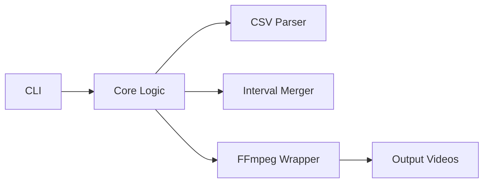

# Contributing to Highlight Cuts

Thanks for your interest in contributing! This guide will help you get started.

## Quick Start for Contributors

```bash
# 1. Fork and clone
git clone https://github.com/yourusername/highlight-cuts.git
cd highlight-cuts

# 2. Install dependencies
uv sync

# 3. Run tests
uv run pytest

# 4. Make changes and test
# ... edit code ...
uv run ruff check .
uv run ruff format .
uv run pytest --cov=src

# 5. Submit PR
git add .
git commit -m "Your changes"
git push
```

## Development Setup

### Prerequisites

- Python 3.13+
- FFmpeg
- Docker (for testing Docker functionality)
- uv (recommended) or pip

### Installation

```bash
# Clone your fork
git clone https://github.com/YOUR_USERNAME/highlight-cuts.git
cd highlight-cuts

# Install all dependencies (including dev dependencies)
uv sync

# Verify installation
uv run pytest
```

## Development Workflow

We follow a standard workflow for all code changes:

### 1. Lint & Format

**Always run before committing**:

```bash
uv run ruff check .
uv run ruff format .
```

Ruff will automatically fix most issues. Manual fixes may be needed for complex linting errors.

### 2. Write Tests

All new features and bug fixes require tests:

```bash
# Run all tests
uv run pytest

# Run specific test file
uv run pytest tests/test_core.py

# Run with coverage
uv run pytest --cov=src
```

**Target**: Maintain >95% test coverage.

See [Testing Guide](testing.md) for testing strategies.

### 3. Update Documentation

Update docs to reflect your changes:

- **User-facing changes**: Update `docs/user/` (quickstart, usage, FAQ, etc.)
- **Developer changes**: Update `docs/dev/` (architecture, tech stack, etc.)
- **Breaking changes**: Update `docs/CHANGELOG.md` prominently
- **All changes**: Update `docs/CHANGELOG.md`

See [Documentation Instructions](../../ai/doc_instructions.md) for guidelines.

### 4. Create Session Summary

Create a summary of your work in `ai/session_summaries/`:

```bash
# Create new file
touch ai/session_summaries/YYYY-MM-DD_session_N.md
```

See [Session Summary Template](../../ai/doc_instructions.md#session-summaries) for structure.

## Code Style

### Python

We use **Ruff** for linting and formatting:

```bash
# Auto-format code
uv run ruff format .

# Check for issues
uv run ruff check .

# Auto-fix issues
uv run ruff check --fix .
```

**Key principles**:
- Follow PEP 8
- Use type hints where helpful
- Keep functions small and focused
- Separate pure logic from side effects (I/O, FFmpeg calls)

### Commit Messages

Use clear, descriptive commit messages:

```
Add xfade transitions support

- Implement concat_clips_with_xfade() function
- Add --transition-type CLI flag
- Update documentation
- Add tests for transition functionality
```

**Format**:
- First line: Brief summary (50 chars or less)
- Blank line
- Detailed description with bullet points

## Testing

### Test Structure

```
tests/
├── test_core.py          # Core business logic
├── test_ffmpeg.py        # FFmpeg wrapper functions
├── test_cli.py           # Command-line interface
├── test_utils.py         # Utility functions
├── test_web.py           # Web interface (HTML/API)
├── test_docker.py        # Docker container
└── test_integration.py   # End-to-end tests
```

### Writing Tests

```python
import pytest
from highlight_cuts.core import merge_intervals

def test_merge_intervals_basic():
    """Test basic interval merging without padding."""
    intervals = [(10, 20), (15, 25), (30, 40)]
    result = merge_intervals(intervals, padding=0.0)
    assert result == [(10, 25), (30, 40)]

def test_merge_intervals_with_padding():
    """Test interval merging with padding."""
    intervals = [(10, 20), (25, 35)]
    result = merge_intervals(intervals, padding=3.0)
    # With padding: [(7, 23), (22, 38)] -> merged to [(7, 38)]
    assert result == [(7, 38)]
```

**Best practices**:
- One test per behavior
- Descriptive test names
- Use `pytest.mark.parametrize` for multiple scenarios
- Mock external dependencies (FFmpeg, file system)

### Mocking FFmpeg

```python
from unittest.mock import patch, MagicMock

@patch("subprocess.run")
def test_extract_clip(mock_run):
    """Test FFmpeg clip extraction."""
    mock_run.return_value = MagicMock(returncode=0)

    extract_clip("input.mp4", 10.0, 20.0, "output.mp4")

    # Verify FFmpeg was called correctly
    assert mock_run.called
    args = mock_run.call_args[0][0]
    assert "ffmpeg" in args
    assert "-ss" in args
    assert "-to" in args
```

### Running Tests

```bash
# All tests
uv run pytest

# Specific file
uv run pytest tests/test_core.py

# Specific test
uv run pytest tests/test_core.py::test_merge_intervals_basic

# With coverage
uv run pytest --cov=src

# With verbose output
uv run pytest -v

# Skip slow tests (integration, Docker)
uv run pytest -m "not slow"
```

## Documentation

All documentation follows the guidelines in [Documentation Instructions](../../ai/doc_instructions.md).

### Key Points

- **Tone**: Casual and friendly
- **Structure**: Hierarchical headings, front-loaded key info
- **Diagrams**: Use Mermaid (not ASCII)
- **Code examples**: Include syntax highlighting
- **AI-friendly**: Use structured lists and clear headings

### Documentation Types

**User docs** (`docs/user/`):
- Simple, deployment-focused
- Step-by-step instructions
- Minimal technical jargon
- Screenshots when helpful

**Developer docs** (`docs/dev/`):
- Technical depth
- Architecture and design decisions
- Code examples and references
- API documentation

## Pull Request Process

### Before Submitting

- [ ] Code is linted and formatted (`ruff`)
- [ ] All tests pass (`pytest`)
- [ ] Test coverage remains >95%
- [ ] Documentation is updated
- [ ] CHANGELOG.md is updated
- [ ] Session summary is created

### Submitting

1. **Push to your fork**:
   ```bash
   git push origin your-branch-name
   ```

2. **Open PR** on GitHub

3. **Fill out PR template**:
   - Describe what changed
   - Link to related issues
   - List any breaking changes
   - Show test results

4. **Wait for review**

### PR Review Criteria

- Code quality and style
- Test coverage
- Documentation completeness
- Backward compatibility
- Performance impact

## Common Contribution Types

### Bug Fixes

1. Create an issue describing the bug
2. Write a failing test that reproduces the bug
3. Fix the code
4. Verify the test now passes
5. Update CHANGELOG.md

### New Features

1. Open an issue to discuss the feature first
2. Get approval before starting work
3. Implement the feature with tests
4. Update all relevant documentation
5. Add entry to CHANGELOG.md

### Documentation Improvements

1. Make changes following [doc_instructions.md](../../ai/doc_instructions.md)
2. Test all code examples
3. Verify all links work
4. Update cross-references if needed

## Project Structure

```
highlight-cuts/
├── src/
│   └── highlight_cuts/
│       ├── __init__.py
│       ├── cli.py           # CLI interface
│       ├── core.py          # Core business logic
│       ├── ffmpeg.py        # FFmpeg wrapper
│       ├── utils.py         # Utilities
│       └── web.py           # Web interface
├── tests/                   # All tests
├── docs/
│   ├── user/               # End-user documentation
│   └── dev/                # Developer documentation
├── ai/
│   ├── session_summaries/  # Development history
│   ├── future/             # Future feature plans
│   └── instructions.md     # Workflow rules
├── data/                   # Input videos (Docker)
├── output/                 # Generated videos (Docker)
└── pyproject.toml          # Project config
```

## Architecture Overview

See [Architecture Guide](architecture.md) for detailed information.

**Key principles**:

1. **Separation of Concerns**: CLI → Core Logic → FFmpeg
2. **Testability**: Pure functions, mock I/O
3. **Speed**: Stream copy by default



## Technology Stack

See [Tech Stack](tech_stack.md) for full details.

**Core dependencies**:
- **click**: CLI framework
- **pandas**: CSV/data processing
- **requests**: HTTP for Google Sheets
- **FastAPI**: Web framework
- **pytest**: Testing

**External dependencies**:
- **FFmpeg**: Video processing
- **Docker**: Containerization

## Getting Help

### Resources

- [Architecture Guide](architecture.md) - Technical design
- [Testing Guide](testing.md) - Testing strategies
- [Tech Stack](tech_stack.md) - Technology choices
- [Documentation Instructions](../../ai/doc_instructions.md) - Doc standards

### Communication

- **Questions**: Open a GitHub Discussion
- **Bugs**: Create an issue
- **Feature requests**: Open an issue for discussion first
- **Security issues**: See [SECURITY.md](../../SECURITY.md)

## Code of Conduct

- Be respectful and inclusive
- Focus on constructive feedback
- Help newcomers learn
- Assume good intentions

## License

By contributing, you agree that your contributions will be licensed under the MIT License.

---

**Ready to contribute?** Pick an issue labeled `good first issue` or `help wanted` to get started!
